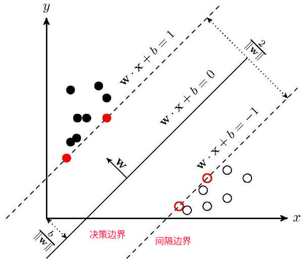
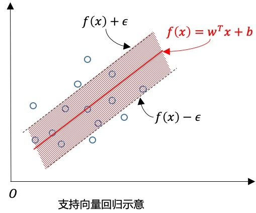

# 约束最优化问题
```math
\begin{aligned}
&min f(x)\\
&s.t. h_i(x)=0\\
&g_i(x)\le 0
\end{aligned}
\rightarrow
```
在最小值处：
```math
\nabla f(x^*)+\sum_i\lambda_i \nabla  h_i(x^*)+\sum_i \mu_i \nabla g_i(x^*))=0\\
\mu_i g(x^*)=0
```
所以原问题可以化为：
```math
min(f(x)+\sum_i \lambda_i h_i(x)+\sum_i \mu_i g_i(x))
```

```
matplotlib inline

# 展示了最小值x*处的梯度应该共线
import matplotlib.pyplot as plt
import numpy as np
import matplotlib
matplotlib.style.use('ggplot')

x = np.linspace(-3, 3, 50)
y = np.linspace(-3, 3, 50)
# 将原始数据变成网格数据
X, Y = np.meshgrid(x, y)

Z = X**2+2*X+Y**2*4+1
# 填充颜色
plt.contourf(X, Y, Z, 10, alpha = 0.4)
# 绘制等高线
C = plt.contour(X, Y, Z, 10, colors = '#009900', alpha=0.5)
# 显示各等高线的数据标签
plt.clabel(C, inline = True, fontsize = 10)
plt.axis('equal')
plt.xlim([-3, 3])
plt.ylim([-3, 3])
xx = np.linspace(-3, 3, 1000)
yy = xx**2 * 0.3 - 4*xx+4.7
plt.plot(xx, yy)
plt.show()
```

## 不等式约束情况：

### 不等式取等号的情况下，`$\mu_i\neq 0$`


### 补充：N维空间之中的k维曲面
N维空间之中的函数为：
`$f(x_1,\cdots, x_n)$`
若函数坐标满足函数关系：
```math
g_i(x_1,\cdots, x_n)=0,\quad i=1,\cdots n-k
```
则上式构成了N维空间之中的k维曲面，衍生出了流形概念。

约束最优化问题完成的是在k维曲面上的最小值问题。而不等式约束依然是在N维部分空间之中。

举个例子：
`$x+y+z=1$`
为三维空间之中的k维曲面。


# SVM分类函数推导
[支持向量机（SVM）——原理篇](https://zhuanlan.zhihu.com/p/31886934)

决策超平面
```math
y=wx+b
```
1 .        
样本数据点为`$(x_i, d_i)$`。可以确定权值w和偏置b使得所有数据点均满足：
```math
(wx_i+b)d_i\ge 1\quad\Rightarrow \\
(wx_i+b)d_i- 1\ge 0
```
其中，值可以为任意实数，最终计算结果相同；取1为方便计算。

2 .    
正样本取1，负样本取-1，则支持向量可定义为
```math
(wx_s+b)d_s = 1
```
支持向量距离到直线的距离为：
```math
r=\frac{1}{\sqrt{w^T\cdot w}}
```

不等式约束
```math
y_i(wx_i+b)\ge 1
```

### 数学约束

> 设决策超平面为
> ```math
> y=wx+b
> ```
> 样本点`$(x_i,y_i)$`到超平面的函数间隔定义为
> ```math
> \gamma_i=y_i(w*x_i+b)
> ```
> 函数间隔大于0，分类正确否则错误，并且值越大，分类结果的确信度越大。
>
>
> 但该定义存在问题，即w和b同时缩小或放大M倍后，超平面并没有变化，但是函数间隔却变化了。
> 所以需要将w的大小固定，如`$||w||=1$`，使得函数间隔固定；即几何间隔，点到直线的距离：
> ```math
> \frac{y_i(w*x_i+b)}{||w||^2} \\
> 
> =\frac{\gamma}{||w||^2}
> ```
> `$\gamma$`为离超平面最近的样本点的距离`$min \gamma_i$`
> 
> 几何间隔越大越好，因此原始的优化目标为
> ```math
> \begin{aligned}
> &max\quad\frac{\gamma}{||w||^2} \qquad ^{[1]}\\
> &s.t.\\
> &\frac{y(w*x_i+b)}{||w||^2} \ge \frac{\gamma}{||w||^2} \qquad ^{[2]}\\
> \end{aligned}
> ``` 
> [1]式表示几何间隔，即使得到 “超平面最近的样本点的” 距离最大，`$\gamma$`可取任意值且不影响几何间隔计算，为方便计算此处取值为1；由此将以上[1]、[2]式整理得：
> ```math
> \begin{aligned}
> &min\quad\frac12{||w||^2} \qquad ^{[1]}\\
> &s.t.\\
> &y(w*x_i+b) \ge 1 \qquad ^{[2]} \tag{1}\\
> \end{aligned}
> ```

### 决策函数
```math
f(x)=sign(w^**x+b^*)
```
`$w$`为特征系数向量     
`$x$`为待预测样本向量
<br>

### 优化函数 

#### 拉格朗日函数

对(1)式引入拉格朗日乘子，整理后原始优化函数为
```math
min_{w,b}max_{\alpha \ge 0}J=\frac{1}{2}w^T\cdot w-\sum_i^N\alpha_i[(wx_i+b)d_i- 1]
```
- 其中
```math
\frac{1}{2}w^T\cdot w
``` 
&#8195; &#8194;也称为正则化。
- <font color=003d79>拉格朗日函数要求不等式约束小于等于0，所以求解[1]式的最大值，即[2]的最小值</font>。
```math
\sum_i^N\alpha_i[(wx_i+b)d_i-1]\quad ^{[1]}\\
-\sum_i^N\alpha_i[(wx_i+b)d_i-1]\quad ^{[2]}
```


#### 拉格朗日对偶问题
原始问题不好求解，为计算方便转为对偶形式
```math
min_{w,b}max_{\alpha\ge 0}J(w,b,\alpha)=p^*

max_{\alpha\ge 0}min_{w,b}J(w,b,\alpha)=d^*
```
若使得`$d^*=p^*$`需要满足两个条件：   

①优化问题是凸优化问题，满足     
②满足KKT条件，即要求
```math
\begin{cases}
\alpha \ge 0\\
d_i(wx_i+b)-1\ge 0\\
\alpha_i(d_i(wx_i+b)-1)=0
\end{cases}
```
在此基于假设条件满足来求解`$\alpha,w,b$`的最优值。

#### 最优问题
最优问题解由鞍点决定，因此符合两个条件：
```math
\frac{\partial J}{\partial w}=0 \\
\frac{\partial J}{\partial b}=0
```
```
# loss对w,b分别求偏导程序
import sympy as sym
sym.init_printing()
w, xi, b, di, ai = sym.symbols("w x_i b d_i a_i")
J=sym.S("1/2")*w*w-ai*((w*xi+b)*di-1)
J.diff(w)
J.diff(b)
wr = sym.solveset(J.diff(w), w)
wr
sym.expand(J)
```
对`$w,b$`求偏导，得
```math
\begin{aligned}
&\frac{\partial J}{\partial w}&=&w-\sum_i^n\alpha_id_ix_i=0 \\
&=>&&w=\sum_i^n\alpha_id_ix_i \quad^{[1]}\\
&=>&&b=d_j-\sum_i^n\alpha_id_ix_ix_j \quad^{[2]}\\
&\frac{\partial J}{\partial b}&=&\sum_i^na_id_i=0 \\
&=>&&\sum_i^na_id_i=0 \quad^{[3]} \tag{2}
\end{aligned}
```

#### 最终拉格朗日函数
<font color=003d79>将以上两个等式带入拉格朗日目标函数消去`$w$`和`$b$`，且将`$\alpha$`求解最大化转为最小化问题</font>
```math
\begin{aligned}
&min_{a_i}J&=&\frac{1}{2}\sum_i\sum_ja_id_ix_ia_jd_jx_j-\sum_i\alpha_i\\
&s.t.\\
&&&\sum_i^na_id_i=0 \\
&&&\alpha \ge 0
\end{aligned}
```
- `$\alpha$`个数与样本个数相同，通过SMO优化算法计算出最优`$\alpha^*$`，在计算出最优`$w^*,b^*$`。
- 需要计算样本间的点乘，所以特征较多时运算效率低

## 最终决策函数
由(2)-[1]式知若`$\alpha$`全为0则w也为0矛盾，所以至少存在一个`$\alpha^*>0$`。 

由KKT条件，对于任意训练样本`$(x_i,y_i)$`总有`$\alpha=0$`或者`$d_i(wx_i+b)=1$`。     

若`$\alpha=0$`，则该样本不会在最后求解模型参数的式子中出现。        
若`$\alpha>0$`，则必有`$d_i(wx_i+b)=1$` ，所对应的样本点位于**间隔边界**上，是一个支持向量。

这显示出支持向量机的一个重要性质：<font color=red>**训练完成后，大部分的训练样本都不需要保留，最终模型仅与支持向量有关</font>**。
```math
f(x)=sign(\sum_i^n\alpha_i^*d_i(x_i*x)+b^*)
```
`$\alpha_i$`在支持向量处是不为0的，所以预测速度是由支持向量的个数决定的;  


## 松弛变量
软间隔，为每个样本引入松弛变量来表征该样本不满足约束的程度，因此线性不可分问题边界为：
```math
\begin{aligned}
&(wx_i+b)d_i+\xi_i\ge 1 \Rightarrow\\ &(wx_i+b)d_i\ge 1-\xi_i\\
&s.t. \\
&\xi_i \ge 0, ~~i=1,2,3...n
\end{aligned}
```
支持向量定义为：
```math
(wx_s+b)d_s= 1-\xi_s
```

#### `$\xi$`取值影响：  
<font color=red>    `$\xi=0$`时为恰好落在**间隔边界**上，    
`$0<\xi\le 1$`为分类正确，落在决策曲面与间隔边界之间，    
`$\xi=1$`为恰好落在**决策曲面**上，    
`$\xi>1$`为分类错误，落在间隔边界以外。
</font>     
我们目标是使得整个超平面上错误目标最小，因此在损失函数之中引入新项。

最优化目标最终变为：
```math
\Phi(w)=\frac{1}{2}w^Tw+C\sum_i\xi_i
```
<font color=red>C > 0    
由`$\xi$`的取值影响，C值越大可能出现的分类错误越小</font>


#### 优化目标函数
```math
J=\frac{1}{2}w^T\cdot w+C\sum_i \xi_i  -\sum_i^N\alpha_i[(wx_i+b)d_i- 1+\xi_i]\\
\xi_i\ge 0
```
根据之前的推导方式，<font color=red>加入松弛变量后整个最大化目标并未改变，仅约束条件变化：
`$\alpha_i\ge 0 \rightarrow 0\le \alpha_i \le C$`</font>


## 线性不可分问题
对于输入空间中的非线性分类问题，可以通过非线性变换将它转化为某个维特征空间中的线性分类问题，在高维特征空间中学习线性支持向量机。

在线性支持向量机学习的对偶问题中，用核函数替代内积，求解得到的就是非线性支持向量机。

#### 目标函数
```math
min_{\alpha_i}~J=\frac{1}{2}\sum_i\sum_ja_id_ia_jd_jk(x_i*x_j)-\sum_i\alpha_i\\
k(x_i*x_j)=\phi(x_i)*\phi(x_j)
```
#### 常用核函数

|种类|支持向量|指定参数|
|--:|--:|--:|
|多项式|`$(x^T x_i)^p$`|p|
|径向基函数|`$e^{-\frac{1}{2\sigma^2}||x-x_i||}$`|`$\sigma$`|

#### 决策函数
决策曲面为
```math
f(x)=sign(\sum_i^n\alpha_i^*d_ik(x_i*x)+b^*)
```

# SVR 回归
[参考文档](https://zhuanlan.zhihu.com/p/50166358)   

分类是找一个平面，使得边界上的点到平面的距离最远，回归是让每个点到回归线的距离最小。

对于样本(x,y)，传统的回归模型通常直接输出 f(x)与真实输出y之间的差别来计算损失，当且仅当f(x)与y 完全相同时，损失才是零。      

与此不同 SVR 假设我们能容忍f(x)与y 之间最多有`$\epsilon$`的偏差，即仅当f(x)与y 之间的差别绝对值大于`$\epsilon$` 时才计算损失。这相当于以`$f(x)$`为中心 构建一个宽度为 `$2\epsilon$` 的间隔带，若样本落入此间隔带，则认为是预测正确的，如下图：      


#### 原始的优化目标
```math
\begin{aligned}
&min_{w,b,ϵ}J=\frac{1}{2}||w||^2+C\sum_{i=1}^m(\xi_i+\hat\xi_i)\\
&s.t.\\
&f(x_i)-y_i\le\epsilon+\xi_i \quad^{[1]}\\
&y_i-f(x_i)\le\epsilon+\hat\xi_i \quad^{[2]}\\
&\xi_i\ge 0\quad and\quad\hat\xi_i\ge 0
\end{aligned}
```
上式中条件[1]、[2]由`$|f(xi)−yi|⩽ϵ+ξi$`推出。

#### 拉格朗日函数
使用拉格朗日乘子法转换为无约束最优化问题，并且转换为对偶形式，对`$w,b,\xi,\hat\xi$`求偏导为零，则最终的优化函数为：
```math
\begin{aligned}
&max_{\alpha,\hat\alpha}\sum_i^my_i(\hat\alpha_i-\alpha_i)-\epsilon(\hat\alpha_i-\alpha_i)\\
&-\frac12\sum_i\sum_j(\hat\alpha_i-\alpha_i)(\hat\alpha_j-\alpha_j)x_i^Tx_j\\
&s.t.\\
&\sum_{i=1}^m\hat\alpha_i-\alpha_i=0\\
&0\le\alpha_i,\quad 0\le\hat\alpha_i\le C
\end{aligned}
```
`$\alpha_i,\hat\alpha_i$`为拉格朗日乘子，分别对应`$\xi_i,\hat\xi_i$`
#### 决策函数
```math
f(x)=\sum_i^n(\hat\alpha_i-\alpha_i)k(x,x_i)+b^*
```
能使上式中`$\hat\alpha_i-\alpha_i\ne 0$`成立的样本即为 SVR 的支持向量，他们必然落在ε-间隔带之外。显然 SVR 的支持向量仅是训练样本的一部分，即其解仍然具有稀疏性。