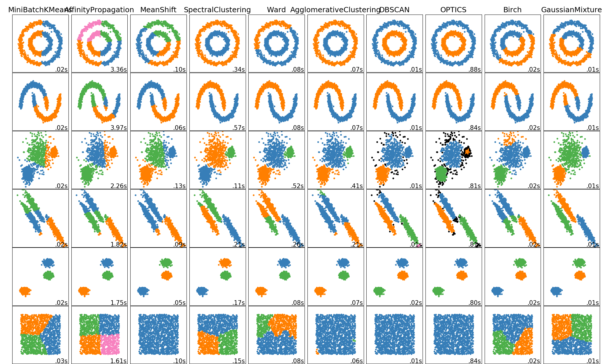

## 笔记


## 概率
#### 1. 贝叶斯学派与频率学派    
- 示例1，抛硬币出现1正3反，求硬币是正面的概率：
    - 频率学派: 1/4，直接统计，【统计学】
    - 贝叶斯学派:     
        - 使用极大似然估计求解, 【理论求解】
        - 求解p(1正3反)过程：
            ```math
            P(x)=C_4^1x^1(1-x)^3
            
            ** log(p) = log(x) + 3log(1-x) + s
            
            \frac{\partial log(p)}{\partial x}=\frac1x + \frac{3}{1-x}
            ```
            1. 极大似然估计
            2. 两边取log 求导
- 示例3，抛硬币出现2正2反，求硬币是正面的概率融入上次的的结果，计算本次的概率，得3/8
- 结论
    - 贝叶斯学派计算概率时，会考虑之前实验概率【先验概率】
    - 先验概率可以纠正样本数量较少的偏差
        - 当样本数量很大时先验概率影响较小
        - 当样本数量很小时先验概率要与样本数量保持均衡，否则影响过大
- 参考[文档/条件概率扩展]
- 应用
    - 正则化： ||W||^2
#### 2. 极大似然估计
- 公式
    ```math
    L=\sum_i log P(x;\theta)
    ```
- Beta分布    
    - 硬币取得正面的概率的概率，即此时θ的分布为Beta分布
    - [参考文档](https://www.zhihu.com/question/30269898)

#### 3. EM 算法
- 数学原理
    - E：确定隐变量的分布
    - M：在给定隐变量的条件下，求取极大似然函数
- 文档
    - 参考【文档/条件概率扩展】中的讲解及示例
    - [参考文档](https://www.jianshu.com/p/6303a96dea88)
- 只有在不存在直接解决的算法的情况下，才考虑使用EM算法，因为它并不是解决限制条件下优化问题的高效方法

## 聚类
- 应用
    - 图像方面，先聚类而后发送给LR，svm模型预测
    - 无监督的分类效果比有监督的弱
- 各种聚类比较    
    
#### 1. k-means ***
- 算法 k 均值。 用于划分的 k 均值算法，每个簇的中心用簇中对象的均值表示。
- 输入：
    - k：簇的数目，
    - D：包含 n 个对象的数据集。
- 输出：k 个簇的集合。
- 过程：
    1. 从 D 中任意选择 k 个对象作为初始簇中心；
    2. repeat
    3. 根据簇中对象的均值，将每个对象（再）指派到最相似的簇；M步
    4. 更新簇均值，即计算每个簇中对象的均值；E步
    5. until不再发生变换
- 优缺：
    - 依据距离计算，所以无法完成复杂聚类，如数据相互缠绕或不规则等
    - 需要给定聚类的初始值，会受初始值的影响
    - 容易受噪声影响
- 参考代码，[basic/kmeans_*]
- 参考文档，[文档/聚类2]
- [参考文章](https://www.jianshu.com/p/4f032dccdcef)
- k-means++
    - 若已经选取了n个聚类中心，则在选取第n+1个聚类中心时，距离当前n个聚类中心越远的点会有更高的概率被选中。
    - 在选取第一个聚类中心(n=1)时同样通过随机的方法。

####  2. 谱聚类
- 对数据进行降维之后再做 K-means 的一个过程。
- 优缺点
    - 只需要数据之间的相似度矩阵
    - 抓住了主要矛盾，忽略了次要的东西，比传统的聚类算法更加健壮，对于不规则的误差数据不是那么敏感
    - 计算复杂度比 K-means 要小
    
#### 3. AP
- 通过投票的方式决定，那些点可以作为中心点
- 无需制定簇的个数
- 参考代码

#### 4. 层次聚类
- 最开始的时候将所有数据点本身作为簇，然后找出距离最近的两个簇将它们合为一个，不断重复以上步骤直到达到预设的簇的个数。
- 优缺点
    - 优点
        - 对任意数据分布都有效果
        - 不用指定簇的个数
        - 容易发现异常点
    - 缺点
        - 速度慢
        - 对超参数的取值很敏感
- 数学原理    
    参考文档[文档/聚类2]
    
#### 5. DBscan
- 概述
    - 典型的基于密度的方法，只要一个区域中的点的密度大过某个阀值，就把它加到与之相近的聚类中去
    - 当参数Eps和MinPts设置恰当该算法可以找出任意形状的簇
- 概念介绍：
    - 邻域，以给定对象P为圆心半径为r的圆形区域； 半径r：eps
    - 核心对象，其领域内的样本点数 >= MinPts
    - 边界点，p的邻域内样本数小于MinPts，非核心对象
    - 噪音点，不与任何密度区域相连
    - 密度直达与可达：o在p的邻域内，从p到o是**直接密度可达**，而q对象的邻域内不包括p，但是包括o，这样p->o->q，称p到q是密度可达的。
    - 密度相连：q和p是密度可达的, q和t也是密度可达的，则p和t是密度相连的。
- 算法过程
    - 输入: 包含n个对象的数据集，半径e，最少数目MinPts;
    - 输出: 所有生成的簇。
    - 过程：
        1. 从数据集中抽出一个未处理的点；
        2. if 抽出的点是核心点:         
            then 找出所有从该点密度可达的对象，形成一个簇；  
        3. else:        
            抽出的点是边缘点(非核心对象)，跳出本次循环，寻找下一个点；
        4. until 所有的点都被处理。
- [参考文章](https://cloud.tencent.com/developer/article/1081025)

#### 6. 高斯混合模型
- 多个正态分布的线性组合，可完成非线性分类
- 假设复合高斯模型
- 数学模型：
    ```math
    \begin{aligned}
    \gamma(x_i,k)&=&\frac{\pi_kf(x_i|\mu,\sigma^2)}{\sum_{k=1}^K\pi_kf(x_i|\mu,\sigma^2)}&&^{[1]}\\
    N_k&=&\sum_{i=1}^N\gamma(x_i,k) &&^{[2]}\\
    \mu_k&=&\frac{\sum_{i=1}^N\gamma(x_i,k)x_i}{N_k}&&^{[3]}\\
    \sigma^2_k&=&\frac{\sum_{i=1}^N\gamma(x_i,k)(x_i-\mu)^2}{N_k}&&^{[4]} \\
    \pi_k&=&\frac{N_k}{N}&&^{[5]}
    \end{aligned}
    ```
    - `$\pi_k$`：隐变量，未知样本属于第k个簇的概率
    - `$\pi_k(x_i|\mu,\sigma^2)$`：样本i在第k簇的加权值
    - `$\gamma(x_i,k)$`：表示第i个样本属于第k簇的比率
    - `$N_k$`：k簇所有样本的比率和
    - E步: 确定数据属于哪个高斯分布
    - M步: 计算高斯分布的参数
- 预测：
    - 参考文档[统计学习/EM算法/高斯混合模型]
    - 参考代码[cluster/GMM_*]
    - [高斯混合模型：聚类原理分析（前篇）](https://cloud.tencent.com/developer/article/1081283)
    - [高斯混合模型（中篇）：聚类求解](https://cloud.tencent.com/developer/article/1082212)
    - [高斯混合模型（后篇）：GMM求解完整代码实现](https://cloud.tencent.com/developer/article/1082273)
- 现状
    - 目前使用的不多，可以使用深度学习替代

#### 7. 距离计算
- 欧式距离
- 余弦距离
- 曼哈顿距离
- ...
- 参考代码 [SimilarityMeasurement]

## 降维
- 分类
    - 无监督算法
    - 线性降维 
       - 降维、恢复及loss函数
        ```math
        \begin{matrix}
            Y_{30} = X_{1,1000} * W_{1000,30}\\
            \hat X_{1000}=Y_{30} * W_{30,1000}\\
            loss=(\hat X-X)^2
        \end{matrix}   
        ```
    - 非线性降维，在线性降维的基础上添加激活函数

#### 1. 稀疏自编码器
- 非线性降维
- 模型
    - 参见以上介绍
    - 使用两个神经网络即可实现
- 编码器：降维
- 解码器：恢复
- 类似的可以做word2vect   <br> 
    示例："今天 天气 不错"，分别为以ABC表示    
    希望输入 B 通过 Y 得到 {A | C}
- 无监督预训练   
    假设一批样本有30万个X，而有标签的有5000
    - 首先用稀疏自编码训练30万个样本，压缩特征数量 
    - 使用压缩后的特征进行分类 

#### 3. PCA 算法
- 主成分分析，通过线性变换将数据变成由线性无关的新变量表示，即
    ```math
    \begin{matrix}
    X'=\frac{1}{n-1}XX^T\\
    X'=UΣV^T\\
    Y=V^TX
    \end{matrix} 
    ```
    1. **计算协方差矩阵，并归一化**
    2. 计算协方差矩阵的特征值与特征向量
    3. 以特征向量矩阵计算主成分矩阵
    - Σ为对角矩阵，对角线上的元素就是特征值
    - 找到一个矩阵，使得协方差矩阵为对角阵
- 特点
    - 无法完成非线性降维任务
    - 强约束，要求降维后各列属性间线性相关性较弱
- 参考：统计学习方法 -> 主成分分析
- [pca与svd的区别](https://zhuanlan.zhihu.com/p/78193297)

#### 4. 其他算法
- ICA算法，独立成分分析
    - 线性模型，又称盲源分析算法
    - 通过线性变换使得各列属性间分布尽可能不同
    - 约束较PCA弱，只要两列分布不同即可
- 字典学习
    - 线性模型
    - 线性变换后数据比较稀疏
- kernel pca    
    对数据做非线性变换之后再进行常规的PCA

#### 5. LDA算法
- 介绍
    - 将词转换为主题表示，即可以完成分类，也相当于降维
- 概念
    - 线性模型， M = T * W
    - M 矩阵结构 [主题，词频]
    - T，主题概率，文章有多个主题组成
    - W，topic-word，主题下某个词出现的概率
    - 认为 M 为 T 个主题下词频 W 叠加而成
    - 注，计算时的topic可以比实际值设置高一点
- 文章【词袋子，无序】生成过程
    1. 根据主题的概率选择主题t
    2. 根据主题词概率选定-个词w
    3. 生产文章的第一个词
    4. 重复这个过程生成一篇文章
    5. 重复这个过程生成整个语料
- LDA文本分类步骤
    1. 读取文本
    2. 文本分词
    3. 文本向量化 -> 稀疏矩阵 -> [文章个数，词个数]
    4. LDA降维 -> 密集矩阵 -> [文章个数，词个数]
    5. 分类
- 实现：变分推断->EM->含有隐藏变量的极大似然估计

#### 6. 文本向量化
- 分词
- 向量化
- 参考代码[TextClassify/text_case.py]

## 课程内容
- part 1
    - 作业问题
    - 公式写法
    - 概率论扩展
- part 2
    - 含有隐藏变量的极大似然估计
    - EM 算法
    - k-means
    - 高斯混合模型
- part 3
    - 多元高斯分布
    - 层次聚类【<<<】
- part 4
    - 图像分割
    - DBscan
    - Ap
    - 降维
- part 5
    - pca
    - ICA
- part 6
    - lda
   
