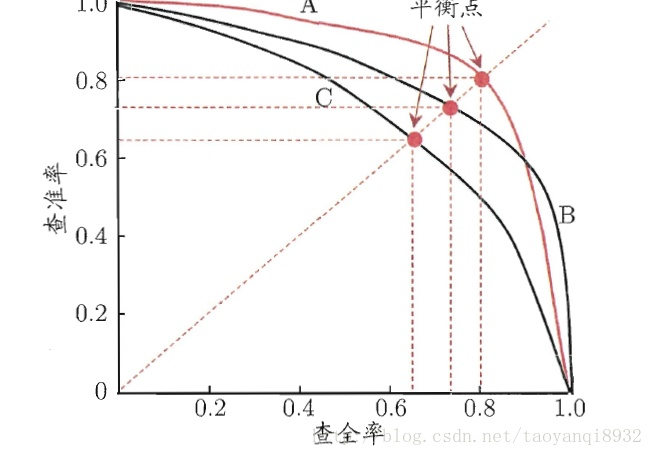
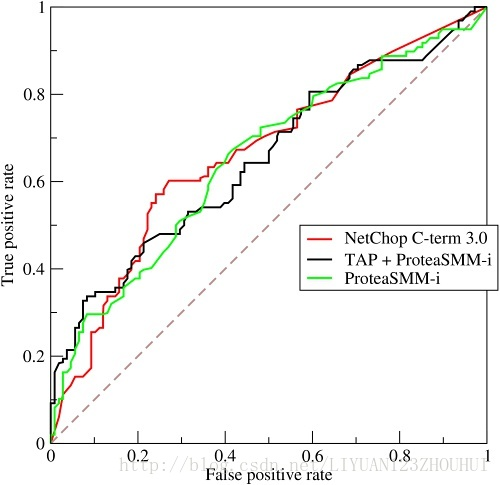

## 分类指标

#### 准确率、召回率、准确率、错误率和F函数
- 混淆矩阵

    \ | 真实正例 | 真实负例
    ---|---|---
    预测正例|TP|FP
    预测负例|FN|TN
    - T，代表预测正确
    - F，代表预测错误
    - P，正
    - N，负
- 精确率，模型判为正的所有样本中有多少是真正的正样本
    ```math
    \begin{aligned}
    precision&=&\frac{TP}{TP+FP} \\
    &=&\frac{TP}{predict\_true\_num}
    \end{aligned}
    ```
    - predict_true_num，预测为正样本的数量
- 召回率，所有正样本有多少被模型判为正样本
    ```math
    \begin{aligned}
    recall&=&\frac{TP}{TP+FN} \\
    &=&\frac{TP}{actual\_true\_num}
    \end{aligned}
    ```
    - actual_true_num，真正的正样本数量
- 准确率
    ```math
    \begin{aligned}
    accuracy&=&\frac{TP+TN}{TP+FP+FN+TN} \\
    accuracy&=&\frac1n\sum_{i=1}^nI(f(x_i)=y_i)
    \end{aligned}
    ```
- 错误率
    ```math
    \begin{aligned}
    error&=&\frac{FP+FN}{TP+FP+FN+TN} \\
    \end{aligned}
    ```
- F1函数，精确率和召回率的调和均值
    ```math
    \begin{aligned}
    \frac2F_1&=&\frac1P+\frac1R \\
    F_1&=&\frac{2PR}{P+R}\\
    F_a&=&\frac{(1+a^2)PR}{a^2P+R}
    \end{aligned}
    ```
    - a给P和R赋予不同的权重，若a=1则为F1值
- 精确率和召回率主要用于二分类问题；准确率能应用于多分类 
 
#### PR曲线
- 召回率R为横轴、以精确率P为纵轴，能够画出P-R曲线    
    
    - 曲线下的面积叫AP分数，能在一定程度上反应模型的精确率和召回率都很高的比例，但这个值不方便计算
    - 先看平滑不平滑
    - 再看谁上谁下，一般来说，上面的比下面的好
- 适用于二分类
- 生成    
    通过置信度就可以对所有样本进行排序，
    再逐个样本的选择阈值，在该样本之前的都属于正例，该样本之后的都属于负例。
    每一个样本作为划分阈值时，都可以计算对应的precision和recall，那么就可以以此绘制曲线。

#### ROC曲线
- 真正率，正确判断为正样本的比例
    ```math
    \begin{aligned}
    TruePositiveRate&=&\frac{TP}{TP+FP} \\
    &=&\frac{|A\cap B|}{B}
    \end{aligned}
    ```
    - sensitivity = recall = true positive rate
- 假正率，误判为正样本的比例
    ```math
    \begin{aligned}
    FalsePositiveRate&=&\frac{FP}{FP+TN} \\
    &=&\frac{|A-B|}{|C-B|}
    \end{aligned}
    ```
    - specificity = 1- false positive rate
- 方式1，混淆矩阵；方式2，设预测的正样本集合为A，真正的正样本集合为B，所有样本集合为 C
- ROC曲线适用于二分类问题，以假正率为横坐标，真正率为纵坐标的曲线图    
    
    - 性质
        - ROC曲线适用于二分类问题，以假正率为横坐标，真正率为纵坐标的曲线图
        - 左上角(0,1)，即FPR=0、TPR=1，此时FN=0、FP=0，模型对所有样本分类正确
        - 右下角(1,0)，即FPR=1，TPR=0，此时FN=1、FP=1，模型对所有样本分类均错误
        - 左下角(0,0)，即FPR=TPR=0，此时TP=0、FP=0模型预测所有的样本都为负样本
        - 右上角(1,1)，即FPR=TPR=0，此时TP=1、FP=1,模型预测所有的样本都为正样本
        - 虚线y=x，对角线上的点表示采用随机猜测策的结果，例如(0.5,0.5)，表示一半猜测其为正样本，另一半为负样本。
        - 横轴FPR越大，预测正类中实际负类越多；
            纵轴TPR越大，预测正类中实际正类越多；
            TPR=1，FPR=0，即图中(0,1)点，故ROC曲线越靠拢(0,1)点，越偏离45度对角线越好，
            **因此ROC曲线越接近左上角，该分类器的性能越好**
    - 优劣
        - 正负样本的分布变化、不均衡的时候，ROC曲线能够保持不变
    - 生成        
        通过设定一个阈值如0.6，概率大于等于0.6的为正类，小于0.6的为负类。
        对应的就可以算出一组(FPR,TPR)，在平面中得到对应坐标点。
        随着阈值的逐渐减小，越来越多的实例被划分为正类，
        但是这些正类中同样也掺杂着真正的负实例，即TPR和FPR会同时增大。
        阈值最大时，对应坐标点为(0,0)，阈值最小时，对应坐标点(1,1)。
        当阈值取值越多，ROC曲线越平滑。
- AUC分数是曲线下的面积（Area under curve），越大意味着分类器效果越好
    - ROC曲线一般都处于y=x这条直线的上方，所以AUC的取值范围一般在0.5和1之间
    - AUC = 1，是完美分类器
    - 0.5 < AUC < 1，优于随机猜测。
    - AUC = 0.5，跟随机猜测一样
    - AUC < 0.5，比随机猜测还差；但只要总是反预测而行，就优于随机猜测。
    
#### mAP
- mAP：mean Average Precision, 即各类别AP的平均值
- AP: PR曲线下面积
- 针对每一个不同的Recall值（包括0和1），选取其大于等于这些Recall值时的Precision最大值，然后计算PR曲线下面积作为AP值
- [参考文章](https://www.jianshu.com/p/ba1f7895b429)

## 回归

#### MES, Mean Squared Error

#### MAS, Mean Absolute Error

#### RMSE, Root Mean Squared Error

#### R2 score
- 不同数据集的量纲不同，消除不同量纲的影响。例，    
    房价数据集有房价均值，学生成绩有成绩均值
- 计算公式
    ```math
    \begin{aligned}
    R^2&=&1-\frac{\sum_{i=1}^m(y_i-\hat y_i)}{\sum_{i=1}^m(y_i-\bar y_i)}\\
    &=&1-\frac{MSE(y,\hat y))}{Var(y)}
    \end{aligned}
    ```
    - R2_score=1：达到最大值，意味着样本中预测值和真实值完全相等，没有任何误差。
    - R2_score=0：此时分子等于分母，样本的每项预测值都等于均值。
    - R2_score<0：分子大于分母，训练模型产生的误差比使用均值产生的还要大，也就是训练模型反而不如直接去均值效果好。